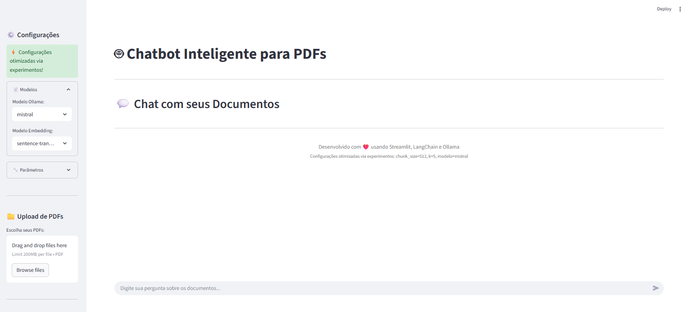
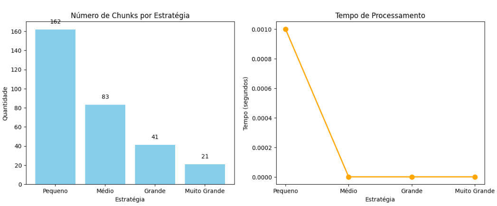

# 📚 Chatbot Inteligente para PDFs - Assistente de TCC

## 🎯 Visão Geral
Este projeto implementa um chatbot interativo que responde perguntas baseado exclusivamente no conteúdo de arquivos PDF. Desenvolvido para auxiliar estudantes e pesquisadores na análise de múltiplos documentos científicos.

## 🏗️ Arquitetura
chatbot-pdf-rag/
│
├── .gitignore
├── README.md
├── app.py
├── requirements.txt
│
├── 📁 assets/
│   ├── print-app.png (corrigido)
│   └── print-experimentos.png (corrigido)
│
├── 📁 inputs/
│   └── (seus PDFs)
│
├── 📁 notebooks/
│   └── experimentos.ipynb
│
└── 📁 src/
    ├── chatbot.py
    ├── pdf_processor.py
    └── vector_store.py

## 🚀 Como Executar
1. Clone o repositório
2. Instale as dependências: `pip install -r requirements.txt`
3. Coloque seus PDFs na pasta `inputs/`
4. Execute: `streamlit run app.py`

## 📊 Resultados

## 💡 Insights Obtidos
- A importância do "chunking" adequado para qualidade das respostas
- Como diferentes modelos de embedding afetam a precisão
- Trade-offs entre usar modelos locais vs APIs

## 🔮 Possibilidades Futuras
- Implementar cache de respostas frequentes
- Adicionar suporte a múltiplos idiomas
- Criar API REST para integração com outros sistemas